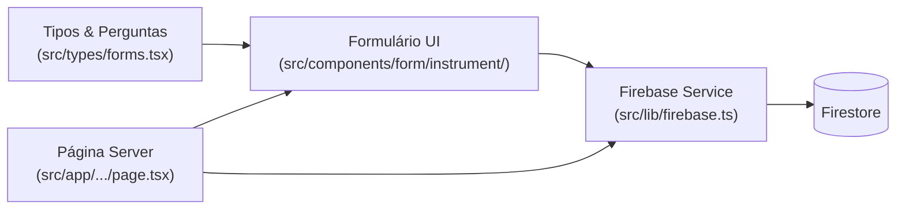
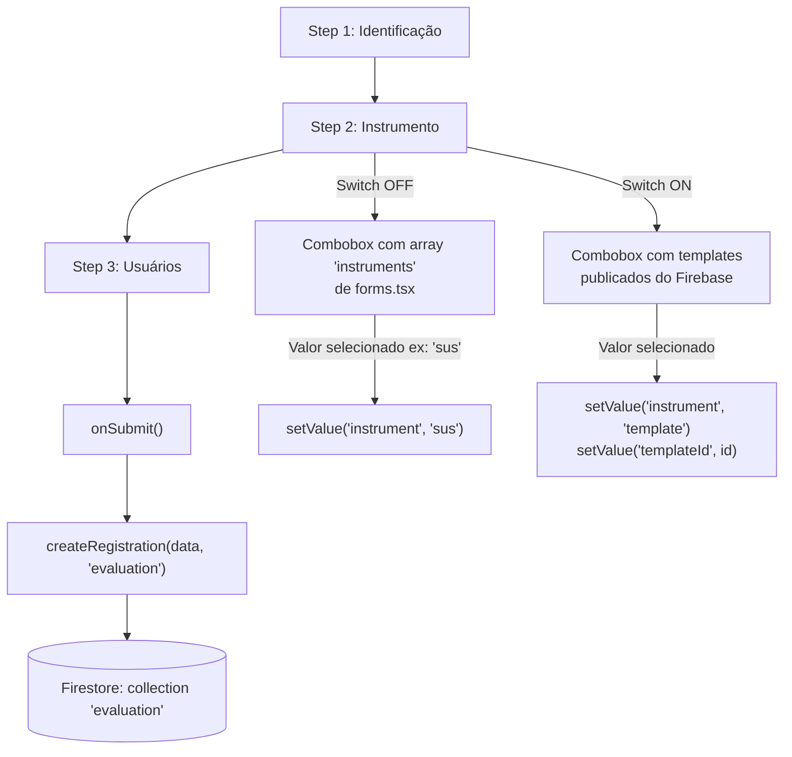
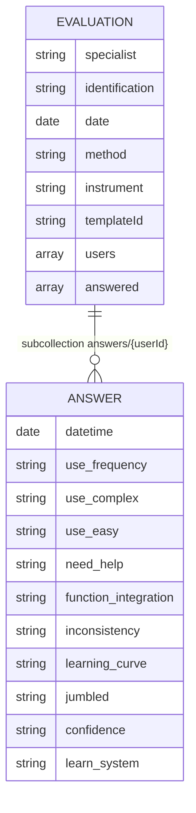
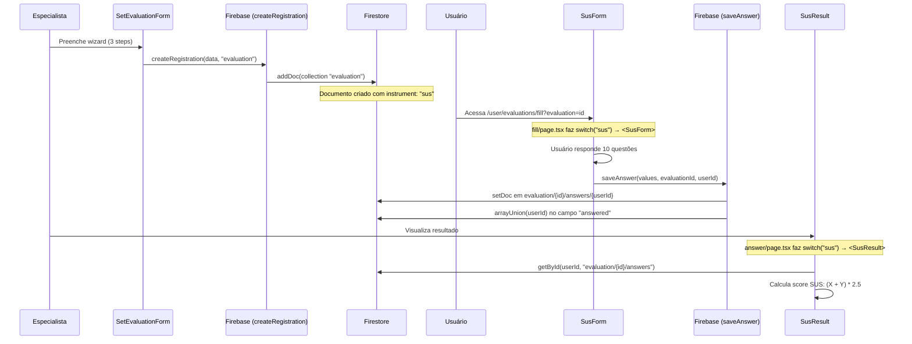
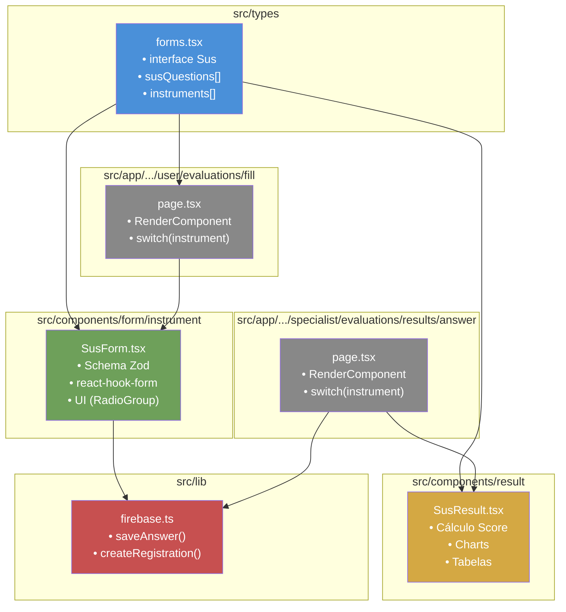

# 🏗️ Mapeamento Técnico — Instrumento SUS no Emoframe

## Visão Geral da Arquitetura

O Emoframe é uma aplicação **Next.js (App Router)** com Firebase (Firestore) como backend. Os instrumentos de avaliação (PANAS, SAM, **SUS**, EAZ, BRUMS, GDS, LEAP) seguem todos o **mesmo padrão arquitetural** de 3 camadas:



---

## 1. 🔄 Fluxo de Criação de Avaliação

O fluxo é um **wizard de 3 etapas** controlado pelo componente `SetEvaluationForm`.

### Arquivos envolvidos

| Camada | Arquivo | Responsabilidade |
|--------|---------|-----------------|
| **Página Server** | [page.tsx](file:///home/lima/dev/faculdade/Emoframe/src/app/(authenticated)/specialist/evaluations/form/page.tsx) | Busca dados do Firebase (usuários do especialista + templates publicados) e repassa para o formulário |
| **Wizard (Client)** | [SetEvaluationForm.tsx](file:///home/lima/dev/faculdade/Emoframe/src/components/form/SetEvaluationForm.tsx) | Formulário multi-step com 3 etapas |
| **DataTable** | [data-table.tsx](file:///home/lima/dev/faculdade/Emoframe/src/app/(authenticated)/specialist/evaluations/form/data-table.tsx) | Tabela de seleção de usuários (Step 3) |
| **Colunas** | [columns.tsx](file:///home/lima/dev/faculdade/Emoframe/src/app/(authenticated)/specialist/evaluations/form/columns.tsx) | Definição das colunas da DataTable |

### O Wizard de 3 Steps



### Como o sistema decide qual formulário carregar (SUS)?

A decisão **não acontece na criação** — acontece quando o **usuário vai responder**. O fluxo é:

1. O especialista cria a avaliação com `instrument: "sus"` → salva no Firestore
2. O usuário acessa `/user/evaluations/fill?evaluation=<id>`
3. A página [fill/page.tsx](file:///home/lima/dev/faculdade/Emoframe/src/app/(authenticated)/user/evaluations/fill/page.tsx) busca a avaliação do Firebase
4. O componente `RenderComponent` faz um **switch/case** no campo `evaluation.instrument`:

```typescript
// fill/page.tsx — Linhas 26-53
const RenderComponent = ({ instrument, userId, evaluationId, identification, template }) => {
  switch (instrument) {
    case "panas":  return <PanasForm {...commonProps} />;
    case "sam":    return <SamForm {...commonProps} />;
    case "sus":    return <SusForm {...commonProps} identification={identification} />;  // ← AQUI
    case "eaz":    return <EazForm {...commonProps} />;
    case "brums":  return <BrumsForm {...commonProps} />;
    case "gds":    return <GdsForm {...commonProps} />;
    case "leap":   return <LeapForm {...commonProps} />;
    case "template": return <TemplateForm {...commonProps} content={template} />;
    default:       return <div>Instrumento não suportado</div>;
  }
};
```

> [!IMPORTANT]
> Este `switch/case` em [fill/page.tsx](file:///home/lima/dev/faculdade/Emoframe/src/app/(authenticated)/user/evaluations/fill/page.tsx#L26-L53) é o **ponto de extensão principal**. Para adicionar um novo instrumento, você adiciona um novo `case` aqui.

O **mesmo padrão** se repete na página de resultados em [answer/page.tsx](file:///home/lima/dev/faculdade/Emoframe/src/app/(authenticated)/specialist/evaluations/results/answer/page.tsx#L26-L53):

```typescript
// answer/page.tsx — Linhas 26-53
const RenderComponent = ({ user, evaluation, data, template }) => {
  switch (evaluation.instrument) {
    case 'panas': return <PanasResult ... />;
    case 'sus':   return <SusResult ... />;   // ← resultado do SUS
    case 'template': return <TemplateResult ... />;
    // ...
  }
};
```

---

## 2. 📍 Onde Moram os Templates / Perguntas do SUS

As perguntas do SUS estão **hardcoded em TypeScript** no arquivo [forms.tsx](file:///home/lima/dev/faculdade/Emoframe/src/types/forms.tsx#L189-L213). **Não vêm do Firebase.** Não são JSON externo.

### Interface de tipagem (Linhas 189-200)

```typescript
export interface Sus {
    use_frequency: string;
    use_complex: string;
    use_easy: string;
    need_help: string;
    function_integration: string;
    inconsistency: string;
    learning_curve: string;
    jumbled: string;
    confidence: string;
    learn_system: string;
}
```

### Array de perguntas (Linhas 202-213)

```typescript
export const susQuestions = [
    { index: 1, field: "use_frequency",       label: "questionnaireUseFrequencyLabel" },
    { index: 2, field: "use_complex",         label: "questionnaireUseComplexLabel" },
    { index: 3, field: "use_easy",            label: "questionnaireUseEasyLabel" },
    { index: 4, field: "need_help",           label: "questionnaireNeedHelpLabel" },
    { index: 5, field: "function_integration",label: "questionnaireFunctionIntegrationLabel" },
    { index: 6, field: "inconsistency",       label: "questionnaireInconsistencyLabel" },
    { index: 7, field: "learning_curve",      label: "questionnaireLearningCurveLabel" },
    { index: 8, field: "jumbled",             label: "questionnaireJumbledLabel" },
    { index: 9, field: "confidence",          label: "questionnaireConfidenceLabel" },
    { index: 10, field: "learn_system",       label: "questionnaireLearnSystemLabel" }
];
```

### Registro no array de instrumentos disponíveis (Linhas 399-405)

```typescript
export const instruments: Instruments[] = [
    // ...
    {  
        value: "sus",
        label: "SUS",
        description: "specialist_services_instruments:sus",
        locales: ["en", "pt"],
    },
    // ...
];
```

> [!NOTE]
> Os `label` são **chaves de i18n**, não texto literal. O texto real está em arquivos de tradução consumidos via `react-i18next`. O namespace para o SUS é `specialist_services_instruments_sus`.

### Padrão consistente entre instrumentos

Todos os instrumentos seguem a mesma estrutura em `forms.tsx`:

| Instrumento | Interface | Array de Perguntas | Registrado em `instruments[]` |
|---|---|---|---|
| PANAS | `Panas` | `panasQuestions` | ✅ |
| SAM | `Sam` | `samQuestions` | ✅ |
| **SUS** | **`Sus`** | **`susQuestions`** | ✅ |
| EAZ | `Eaz` | — | ✅ |
| BRUMS | `Brums` | — | ✅ |
| GDS | `Gds` | `gdsQuestions` | ✅ |
| LEAP | `Leap` | `leapQuestions` | ✅ |

---

## 3. 🔗 Conexão Frontend-Backend

### Ao CRIAR uma avaliação (especialista)

Função chamada: [createRegistration](file:///home/lima/dev/faculdade/Emoframe/src/lib/firebase.ts#L139-L151)

```typescript
// firebase.ts — Linhas 139-151
export async function createRegistration(data: Evaluation | Template, type: string): Promise<any> {
    const docRef = collection(db, type); // type = "evaluation"
    const registration = getValuable(data);
    addDoc(docRef, registration); // Insere um novo documento no Firestore
}
```

**Objeto `Evaluation` enviado ao Firestore:**

```typescript
// Estrutura real do objeto (montado em SetEvaluationForm.tsx, linha 116)
{
  specialist: "uid_do_especialista",      // string
  identification: "Avaliação SUS Lab X",  // string (nome dado pelo especialista)
  date: Date,                              // Date object
  method: "Autorrelato",                   // string
  instrument: "sus",                       // string — "sus" | "panas" | "sam" | "template" | etc.
  templateId?: "abc123",                   // string (só quando instrument === "template")
  users: ["uid_user_1", "uid_user_2"],     // string[]
  // answered: [] — preenchido depois, pelo saveAnswer
}
```



### Ao RESPONDER uma avaliação (usuário)

Função chamada: [saveAnswer](file:///home/lima/dev/faculdade/Emoframe/src/lib/firebase.ts#L84-L102)

```typescript
// firebase.ts — Linhas 84-102
export async function saveAnswer(
    data: Panas | Sam | Sus | Eaz | Brums | Gds | Leap | TemplateAnswers,
    EvaluationId: string,
    UserId: string
): Promise<any> {
    // 1. Salva as respostas como subdocumento
    const docRef = doc(db, "evaluation", EvaluationId, "answers", UserId);
    const answer = { datetime: new Date(), ...getValuable(data) };
    await setDoc(docRef, answer);
    
    // 2. Marca o usuário como "respondeu" no documento da avaliação
    const docRef2 = doc(db, "evaluation", EvaluationId);
    await updateDoc(docRef2, {
        answered: arrayUnion(UserId)
    });
}
```

**Objeto `Sus` salvo como resposta no Firestore:**

```typescript
// Path: evaluation/{evaluationId}/answers/{userId}
{
  datetime: Timestamp,           // Data/hora da resposta
  use_frequency: "4",            // Likert 1-5
  use_complex: "2",
  use_easy: "5",
  need_help: "1",
  function_integration: "4",
  inconsistency: "2",
  learning_curve: "5",
  jumbled: "1",
  confidence: "4",
  learn_system: "2"
}
```

> [!TIP]
> A chamada no `SusForm.tsx` (linha 87) é: `saveAnswer(values, params.evaluationId, params.userId)`. Os `values` vêm diretamente do `react-hook-form`, que espelha 1:1 os campos do `SusFormSchema`.

### Fluxo completo de dados



---

## 4. 🧩 Anatomia do Micro Frontend — Os 3 Arquivos Principais

Com base no padrão existente, para criar um novo instrumento de forma **modular**, você precisa de **3 arquivos** (+1 de resultado):

### Arquivo 1: Tipos e Perguntas → `src/types/forms.tsx`

> Não é um arquivo novo — você **adiciona** ao existente.

```typescript
// 1. Interface das respostas
export interface MeuInstrumento {
    campo_1: string;
    campo_2: string;
    // ...
}

// 2. Array de perguntas
export const meuInstrumentoQuestions = [
    { index: 1, field: "campo_1", label: "chave_i18n_pergunta_1" },
    { index: 2, field: "campo_2", label: "chave_i18n_pergunta_2" },
];

// 3. Registro no array 'instruments'
export const instruments: Instruments[] = [
    // ... existentes ...
    {
        value: "meu_instrumento",
        label: "MEU INSTRUMENTO",
        description: "namespace:descricao",
        locales: ["pt"],
    },
];
```

### Arquivo 2: Formulário do Usuário → `src/components/form/instrument/MeuInstrumentoForm.tsx`

> **Novo arquivo.** Use o [SusForm.tsx](file:///home/lima/dev/faculdade/Emoframe/src/components/form/instrument/SusForm.tsx) como template.

Estrutura interna:
```
MeuInstrumentoForm.tsx
├── Zod Schema (validação derivada do array de perguntas)
├── react-hook-form (controle de estado)
├── RadioGroup com escala Likert (5 opções)
├── onSubmit → saveAnswer(values, evaluationId, userId)
└── i18n via useTranslation('namespace')
```

### Arquivo 3: Visualização de Resultado → `src/components/result/MeuInstrumentoResult.tsx`

> **Novo arquivo.** Use o [SusResult.tsx](file:///home/lima/dev/faculdade/Emoframe/src/components/result/SusResult.tsx) como template.

Estrutura interna:
```
MeuInstrumentoResult.tsx
├── Props: { user: User, evaluation: Evaluation, data: MeuInstrumento }
├── Cálculo de pontuação customizado
├── Google Charts (gráfico de resultados)
├── Tabela de interpretação
└── Tabela de respostas do usuário
```

### Pontos de Integração (editar arquivos existentes)

Além dos 3 arquivos, você precisa registrar o novo instrumento em **4 pontos**:

| # | Arquivo | Alteração | Linha de Ref. |
|---|---------|-----------|---------------|
| 1 | [forms.tsx](file:///home/lima/dev/faculdade/Emoframe/src/types/forms.tsx) | Adicionar interface + questions + registro em `instruments[]` | L189, L387 |
| 2 | [fill/page.tsx](file:///home/lima/dev/faculdade/Emoframe/src/app/(authenticated)/user/evaluations/fill/page.tsx) | Adicionar `case "meu_instrumento":` no switch | L29-52 |
| 3 | [answer/page.tsx](file:///home/lima/dev/faculdade/Emoframe/src/app/(authenticated)/specialist/evaluations/results/answer/page.tsx) | Adicionar `case "meu_instrumento":` no switch | L27-53 |
| 4 | [firebase.ts](file:///home/lima/dev/faculdade/Emoframe/src/lib/firebase.ts) | Adicionar tipo na union de `saveAnswer()` | L84 |

### Diagrama de dependências entre arquivos



---

## Resumo: Checklist para Novo Instrumento

- [ ] **1.** Definir `interface` e `questions[]` em `src/types/forms.tsx`
- [ ] **2.** Registrar no array `instruments` em `src/types/forms.tsx`
- [ ] **3.** Criar `src/components/form/instrument/NovoForm.tsx`
- [ ] **4.** Criar `src/components/result/NovoResult.tsx`
- [ ] **5.** Adicionar `case` no switch de `fill/page.tsx` (resposta do usuário)
- [ ] **6.** Adicionar `case` no switch de `answer/page.tsx` (resultado para especialista)
- [ ] **7.** Adicionar tipo na union de `saveAnswer()` em `firebase.ts`
- [ ] **8.** Criar namespace i18n para as traduções do instrumento

> [!WARNING]
> Se o seu micro frontend será **externo** (hospedado separadamente), a integração vai exigir uma estratégia diferente. O padrão atual é monolítico — todos os instrumentos vivem dentro do mesmo app Next.js. Para um micro frontend real, você precisará definir: (1) um contrato de comunicação (ex: postMessage / Module Federation), (2) onde o componente será montado, e (3) como compartilhar o contexto de autenticação (NextAuth session).
